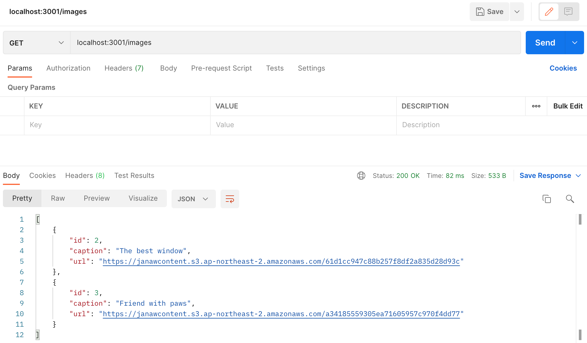
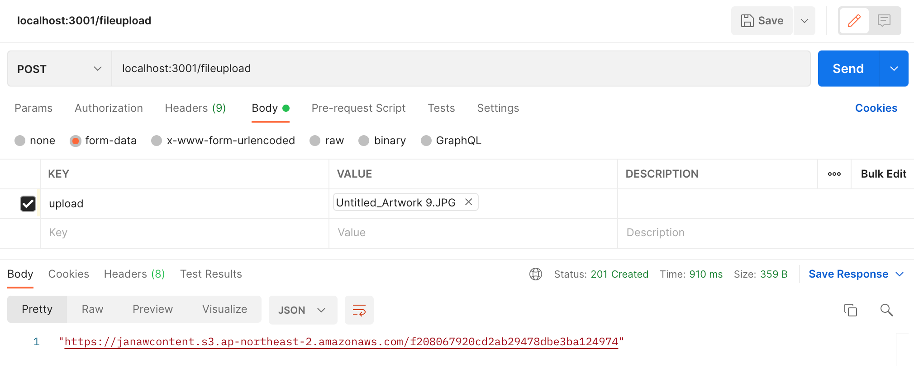

# Image File Uploader
[](https://www.npmjs.com/package/@nestjs/typeorm)
[](https://www.npmjs.com/package/aws-sdk)
[](https://www.npmjs.com/package/typescript)

> Server application of [Canvas Confetti Admin](https://github.com/plutach/cc_admin). This project is used to upload files/images to a AWS S3 bucket, while saving image information to a database table.

## Features
> Upload an image to AWS S3 bucket while saving the url and image information to a database table.


## Installation

```bash
$ npm install
```

## Running the app

```bash
# development
$ npm run start

# watch mode
$ npm run start:dev

# production mode
$ npm run start:prod
```
## Test with Postman 




